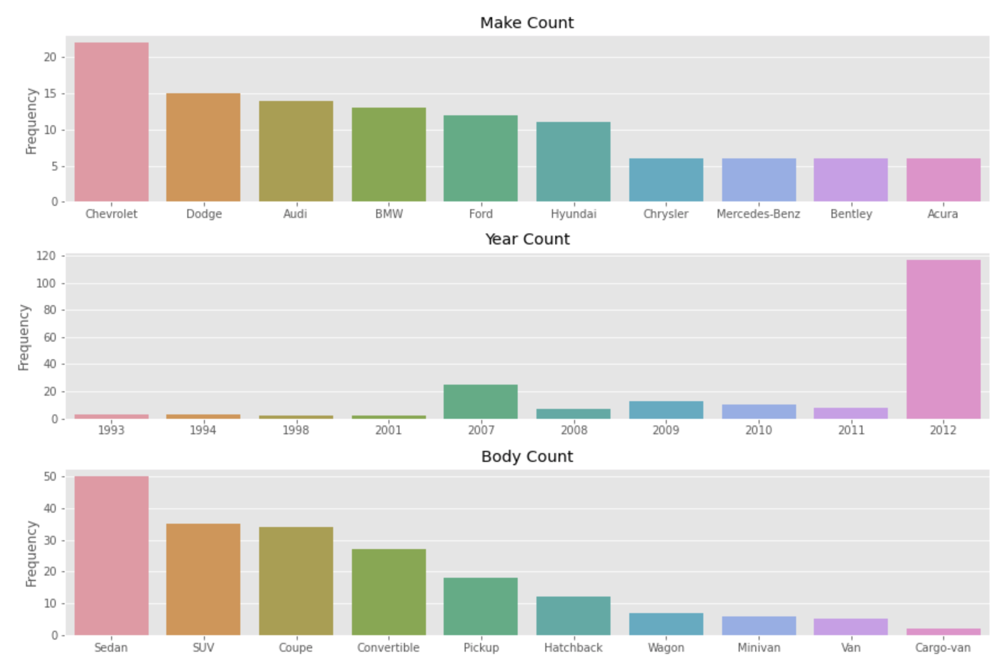
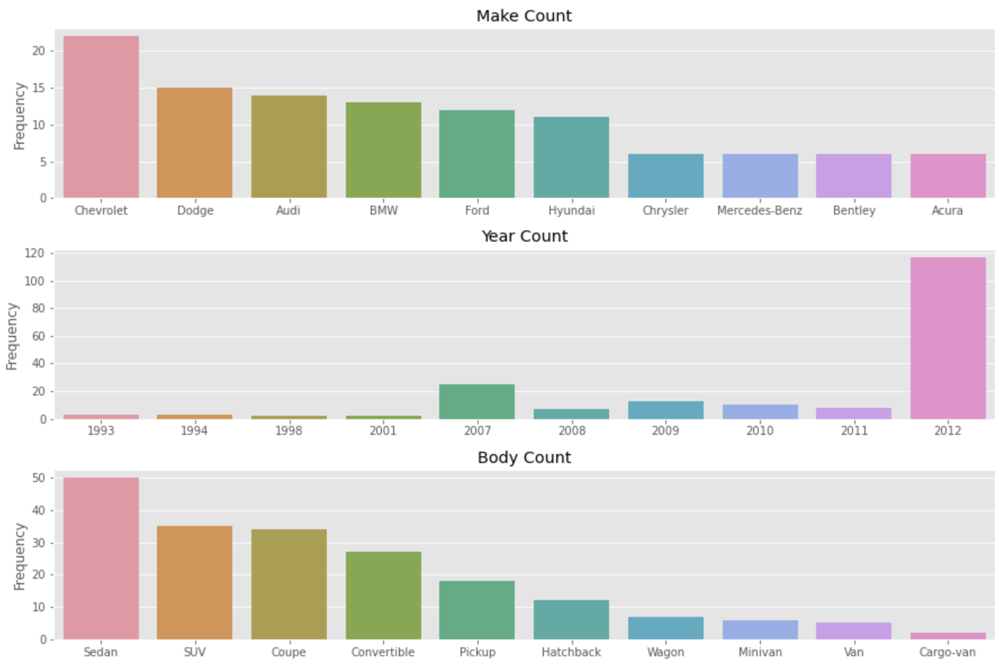
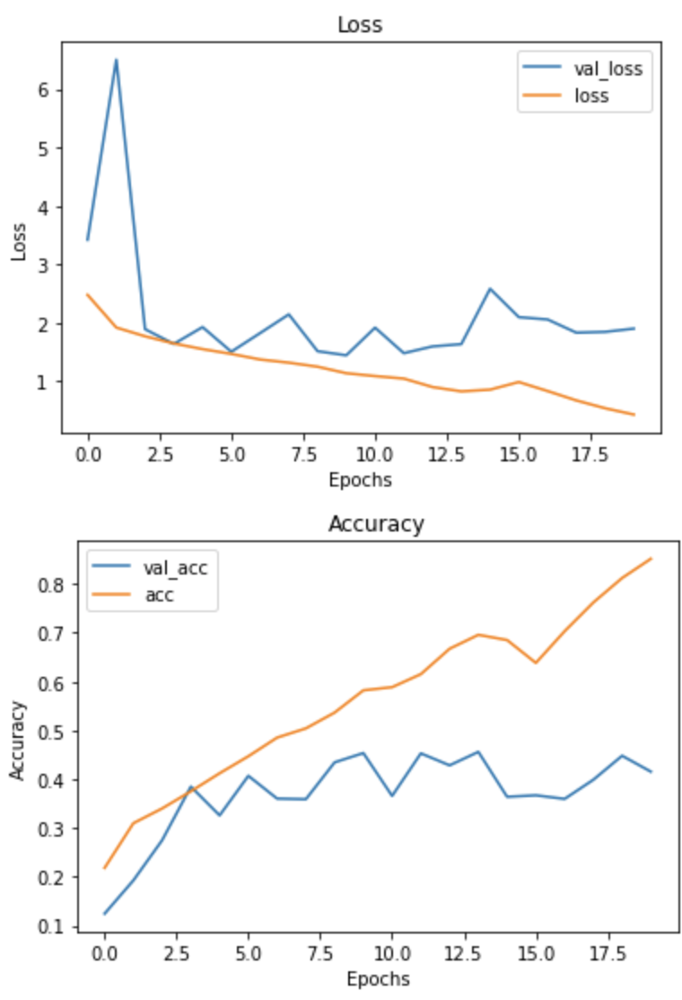
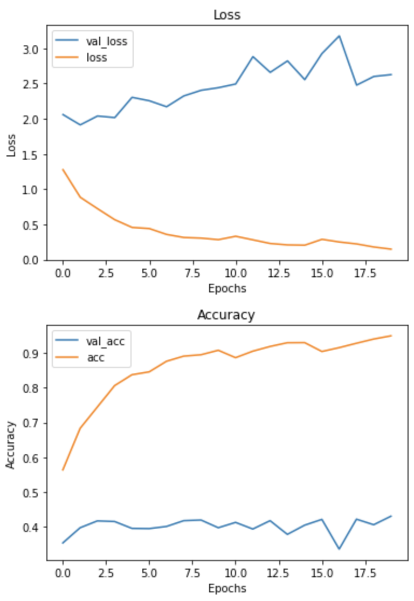
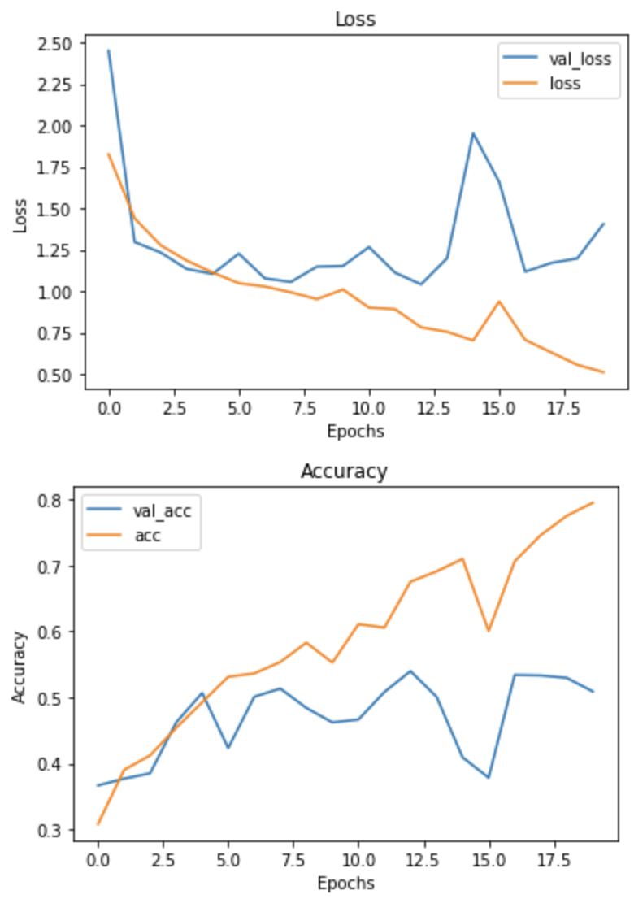
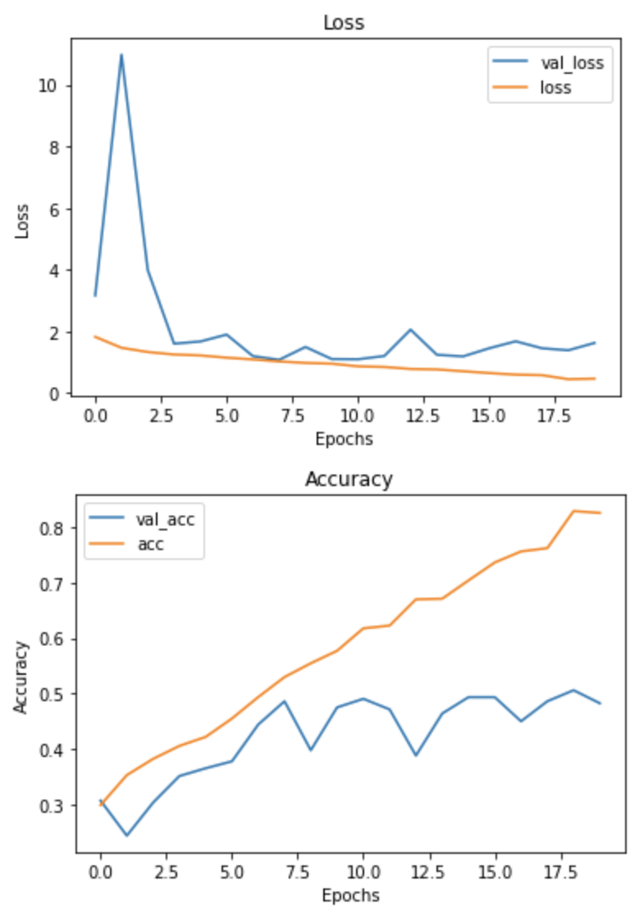
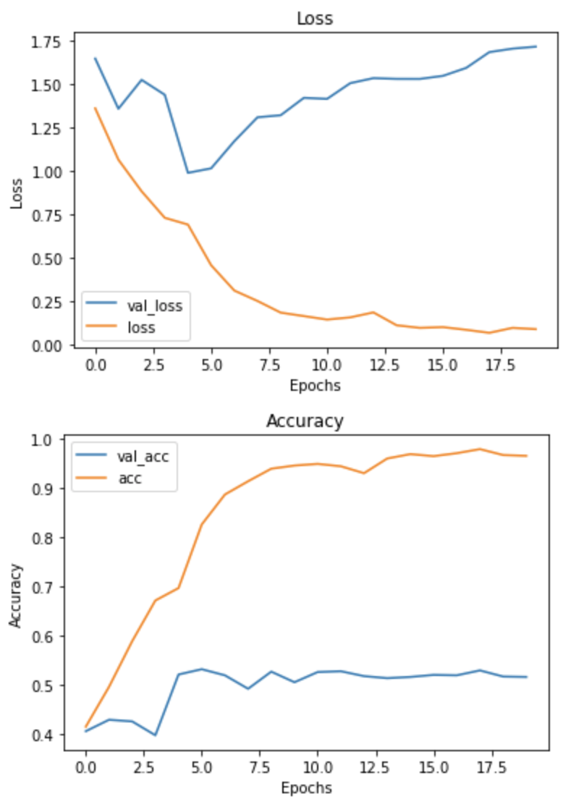
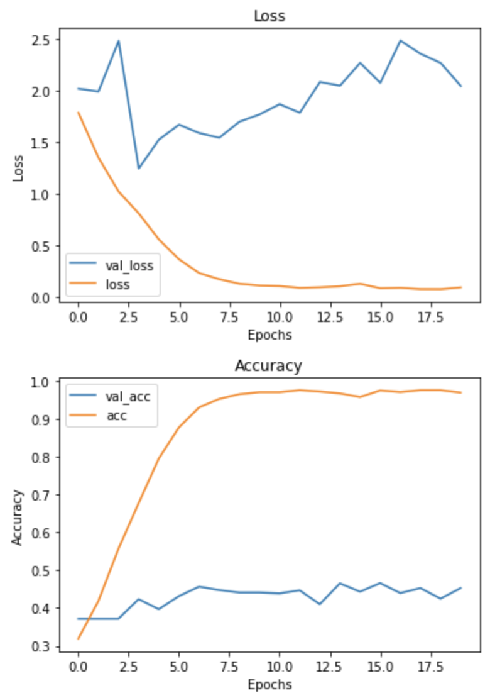
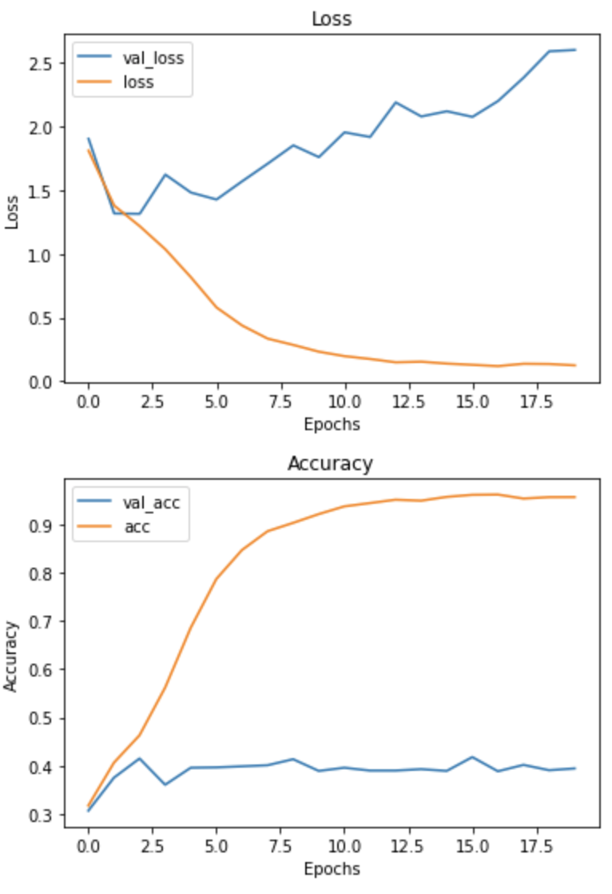
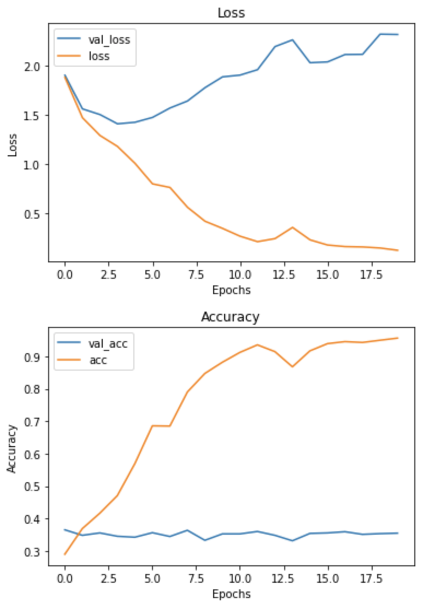

# Car Classification

Analysis Questions:  
1) Can we successfully classify cars by their body type?
2) Can we use a model in production?
3) How can we use this data to predict the cost of a car?

## Data Description
The data sets contain 16,185 images. Half of the images are training images, and the other half are testing images. The data set is stored in the car_data directory. car_data contains two subdirectories named test and train, at times there might be a third custom category. However, the third category is the same data set, but it is saved in custom format such as by body type or make. Within the test and train directories, it contains sub directories with the year, make, model, and body type of the car. This data set was compiled by Stanford University, and it can be found [here](https://ai.stanford.edu/~jkrause/cars/car_dataset.html).

## Data Cleaning
For this project, there was no cleaning done to the data. All the data was included in the analysis.

**Data Frame**
The data set did not include a data frame of the data, so a function was used in order to create a data frame from the car_data directory.

## Data Exploration
**Test Unique Data**

**Train Unique Data**

Both sets have about the same amount of data for each category. However, the data in each category is not symmetrical. For example, in the **Make** category, the range of samples goes from over 20 cars to about 5, the **Year** category is not usable due to most samples being from 2012, and the **Body** category substantially decreases after the 4th category.

The pictures in the data set contain various angles of each car, but they are not always of the same car. The sources of the pictures include promotional photos from manufactures, promotional photos from dealerships that include frames such as the phone number, and photos taken for non-promotional activities. 

## Data Preprocessing
The data was preprocessed in the following ways:
1) Photos were resized to 100x100.
2) The pixels of each photo were normalized to be between 0 and 1.

Additional ways photos were preprocessed for certain models:
1) Turned photos into greyscale.
2) Added random zooms and rotations. 

## Models
Two following two convolutional neural network were used:
1) The larger model contained 5 hidden layers that contained batch normalization, dropout, and 2 of them contained maxpooling.
2) The smaller model contained 2 hidden layers that contained batch normalization, dropout, and maxpooling.

### Data Used
2 models included data from the whole data set. In order to investigate if a model could be effectively used, the data set was made smaller by looking only at 4 categories. Coupes and convertibles were combined, SUVs, Sedans, and Pickup trucks.

|Iteration|Base|Greyscale|1|1G|2|2G|3|3G
|---|---|---|---|---|---|---|---|---|
|Accuracy|.4315|.4190|.5147|.4914|.4795|.4547|.3898|.3450
|F1 Score (macro)|.32|.29|.49|.47|.45|.41|.30|.28|
|Model|Large Network|Large Network|Large Network|Large Network|Smaller Network|Smaller Network|Smaller Network|Smaller Network|

Each iteration was performed twice. Once in RGB and once in greyscale. This is indicated by a G next to the iteration number.

**Base:** In the base model, all the available data was used.  

**Greyscale:** The greyscale model included all the data but in greyscale.  

**1 and 1G:** In the first iteration the data set was focused into 4 categories. Coupes/convertibles, Sedans, Pickup Trucks, and SUVs.

**2 and 2G:** The same data from the previous iteration was performed, but it was used to train a smaller neural network. 

**3 and 3G:** The smaller neural network was used, and random data augmentation was performed on the data set.

For all models, it was observed that they were overfitting. Strategies such as maxpooling, dropping out data, batch normalization, and making the network smaller were used to reduce overfitting. However, it seems that more data is needed in order to keep the model from overfitting.

## Conclusion
From all the different models, it can be concluded that iteration 1 in greyscale performed the best. Although this model had the second best F1 score and accuracy, it used less resources than the other models. The greyscale data set was 1/3 the size of a full RGB data set. After training, the model was 10% the size of the larger network trained on the same data.

With the technique used in this analysis, it can be concluded that cars can be classified by their body type successfully. However, to take this analysis further, more data will be needed to successfully use this technique. By using this technique, it would not be able to successfully predict the cost of a car.

A demonstration of this model classifying cars by body type can be found [here](https://jake-car.herokuapp.com). The source code can be found [here](Jake/ReadMe.md)

***Citation***  
3D Object Representations for Fine-Grained Categorization
Jonathan Krause, Michael Stark, Jia Deng, Li Fei-Fei
4th IEEE Workshop on 3D Representation and Recognition, at ICCV 2013 (3dRR-13). Sydney, Australia. Dec. 8, 2013.

